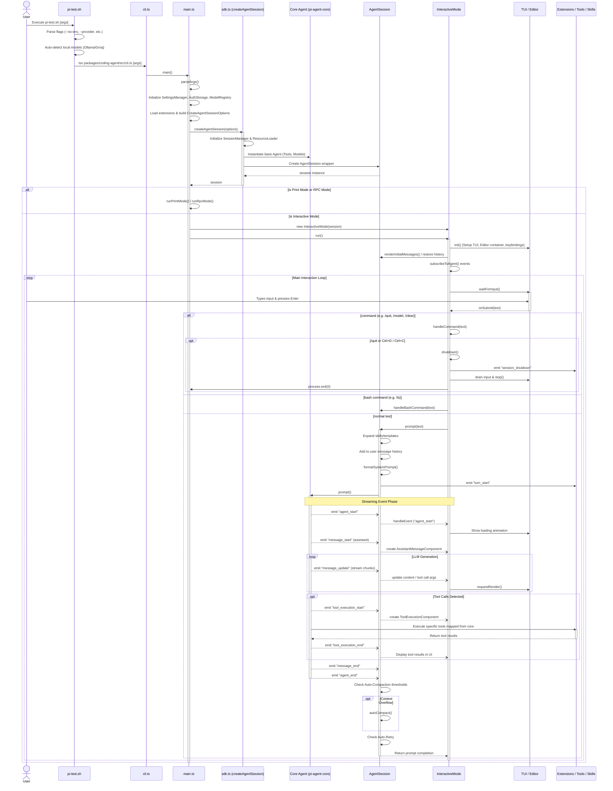

# Project Control Flow: From Execution to Shutdown

This document outlines the complete control flow of the pi-agent project, starting from the execution of the initial shell script to the closing of the command-line interface. 

## Sequence Diagram

The following Mermaid sequence diagram illustrates the chronological order of operations, showing how different components interact to handle initialization, the main interaction loop, and the final shutdown sequence.

## Step-by-Step Explanation

### 1. Bootstrapping and Initialization
1. **Entry Point (`pi-test.sh`)**: The process begins when the user executes the `pi-test.sh` shell script. The script is responsible for environment setup: it validates prerequisites (like `tsx`), parses shell-specific flags (e.g., `--no-env`, `--no-ollama`), configures API keys from environment variables, and auto-detects locally running providers like Ollama. After scaffolding the environment, it delegates execution to the Node CLI.
2. **Node Execution (`cli.ts` -> `main.ts`)**: `cli.ts` simply imports and invokes the async `main()` function in `main.ts`. Here, the Node process uses CLI argument parsers (like `yargs` or `cac`) to ingest configuration flags. It handles basic package management commands (install, remove, list) and sets up core service singletons such as the `SettingsManager`, `AuthStorage`, and `ModelRegistry`.
3. **Session Creation (`sdk.ts` -> `createAgentSession`)**: `main.ts` bundles all context into an options object and invokes `createAgentSession()`. This deeply initializes the application:
   - Sets up a `SessionManager` to load/save JSON histories.
   - Instantiates a `ResourceLoader` for skills, prompts, and themes.
   - Creates the underlying `Agent` core engine (which holds the pure tool logic and LLM API clients).
   - Wraps the core agent with the stateful `AgentSession` class, which manages persistence, queues, and event streams.

### 2. Interactive UI Setup
4. **Booting Interactive Mode**: Unless bypassing the TUI (via RPC/print arguments), `main.ts` instantiates `InteractiveMode` and calls its `run()` loop.
5. **UI Scaffolding**: Inside `run()`, it calls `init()`. This establishes the visual grid using the internal TUI library (`@mariozechner/pi-tui`). It creates the Terminal UI instance, maps shortcut keystrokes, launches the main text editor and chat flow components, loads theme colors, and restores previously saved conversations from the `SessionManager`. 
6. **Event Subscriptions**: Crucially, `InteractiveMode` calls `subscribeToAgent()` to eavesdrop on all asynchronous events emitted by the `AgentSession` (like `message_start`, `tool_execution_start`, `message_update`). This separation of concerns allows the underlying agent to process logic independently while mapping updates strictly to visual components.

### 3. The Main Execution Loop
7. **Waiting for Input**: `InteractiveMode` binds an infinite `while(true)` loop that yields on `getUserInput()`. Standard text input submits via the `onSubmit` hook.
8. **Command and Shell Processing**:
   - If the input starts with `/` (e.g. `/model`, `/compact`), `InteractiveMode` directly manages the CLI command.
   - If the input starts with `!` (e.g. `!ls -al`), it is passed to a bash execution handler to be run locally, appending the result visually.
9. **Core Agent Prompting**: Regular text is passed to `AgentSession.prompt()`. The session processes the input by injecting extension templates, expanding skill macro calls, formatting the current system prompt, and pushing the new payload to the base `Agent`.
10. **LLM Generation and Streaming**: As the core `Agent` interacts with standard endpoints (via HTTP/OpenAI adapters), it streams packets back asynchronously. `AgentSession` rebroadcasts these as events. `InteractiveMode` catches `message_update` and manipulates a `StreamingMessageComponent` on the screen, updating text chunks as they arrive frame-by-frame.
11. **Tool Invocations**: When the LLM chooses to execute a tool (like reading a file or creating a file), the core agent pauses streaming, identifies the tool, executes it natively, and updates the state. The TUI captures `tool_execution_start` to render the collapsible UI block and `tool_execution_end` to paste the result inline.
12. **Post-Processing**: Upon `agent_end`, `AgentSession` handles automatic health checks such as context window compaction (summarizing old messages if tokens exceed the limit) or automatic retries on LLM malformed responses.

### 4. Shutdown Sequence
13. **Shutdown Trigger**: The execution loop breaks gracefully when a shutdown is invoked via:
    - The literal `/quit` command.
    - `Ctrl+D` executed on an empty prompt.
    - Double `Ctrl+C` fired within a 500ms time threshold. 
14. **Cleanup Logic**: The `shutdown()` method inside `InteractiveMode` is triggered. It acts in specific phases:
    - Emits a `session_shutdown` hook to all loaded extensions so they can stop their listeners or save buffers.
    - Yields to the event loop `process.nextTick()` to allow final TUI renders to paint.
    - Drains remaining inbound keyboard I/O to avoid polluting the host's raw terminal context.
    - Destroys the UI process gracefully (`this.ui.stop()`).
    - Quits using `process.exit(0)`.
